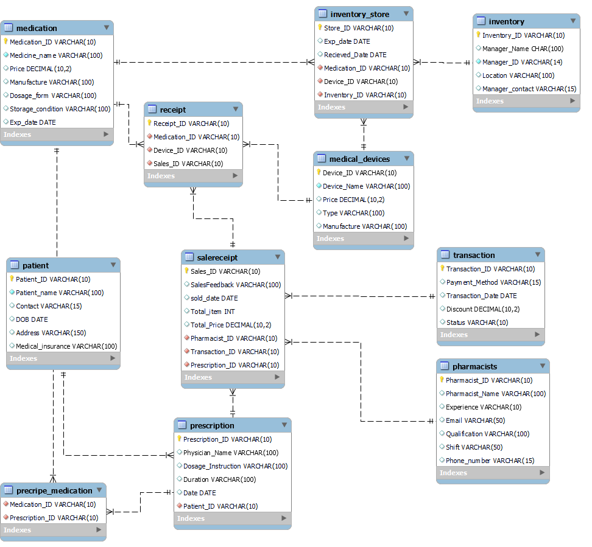

# 💊 Pharmacy Management System


> Production-grade relational database schema for full-lifecycle pharmacy operations — from prescription intake to sales reconciliation. Designed to 3NF with 11 normalized entities, 14+ referential integrity constraints, and a complete audit trail across patients, pharmacists, inventory, and transactions.

---

## 📸 Screenshots

<!-- ER Diagram — full entity-relationship diagram showing all 11 tables and their foreign key connections -->


<!-- Schema Overview — MySQL Workbench or DBeaver screenshot showing all 11 tables in the left panel after running the script -->


<!-- SaleReceipt Query — screenshot of a SELECT JOIN query output linking SaleReceipt → Pharmacist → Transaction → Prescription -->


<!-- Inventory Store — screenshot showing the Inventory_Store table populated with medications and devices per location -->


---

## ✨ Key Features

- **11-Table 3NF-Normalized Schema** — Decomposed a complex pharmacy domain into 11 discrete entities with zero data redundancy; single-source updates propagate automatically via cascading constraints across all dependent records.

- **Many-to-Many Prescription–Medication Modeling** — Resolved an inherent M:N relationship via a composite-primary-key junction table (`Precripe_Medication`), supporting unlimited medication combinations per prescription with full referential integrity.

- **System-Wide Cascading Referential Integrity** — All 14+ foreign key relationships enforce `ON UPDATE CASCADE / ON DELETE CASCADE`, eliminating orphaned records and removing the need for application-layer consistency checks.

- **Unified Dual-Entity Inventory Tracking** — `Inventory_Store` bridges both medications and medical devices under a single inventory location record with expiry and received-date tracking — enabling pharmacy-wide stock audits in one query.

- **End-to-End Sales Audit Trail** — `SaleReceipt` correlates every sale to the dispensing pharmacist, payment transaction, and originating prescription, creating a full chain of custody compliant with pharmacy record-keeping standards.

---

## 🗂️ Database Schema

| Table | Description |
|---|---|
| `Inventory` | Inventory locations and managers |
| `Medication` | Drug catalog with pricing, dosage, and storage conditions |
| `Medical_Devices` | Equipment catalog |
| `Pharmacists` | Staff records with qualifications and shift assignments |
| `Transaction` | Payment records (cash, card, online) with discount tracking |
| `Patient` | Patient demographics and insurance status |
| `Prescription` | Physician-issued prescriptions linked to patients |
| `SaleReceipt` | Sales records linking pharmacist, transaction, and prescription |
| `Inventory_Store` | Stock bridge: medications and devices per inventory location |
| `Receipt` | Line items linking medications/devices to a sale |
| `Precripe_Medication` | Junction table resolving prescription ↔ medication M:N |

---

## 🚀 Installation & Usage

### Prerequisites

- MySQL 8.0+ (or MariaDB 10.5+)
- MySQL CLI or MySQL Workbench

### Run the Schema

```bash
# Option 1: MySQL CLI
mysql -u root -p < database/schema.sql

# Option 2: Source from the MySQL prompt
mysql -u root -p
```

```sql
SOURCE /path/to/database/schema.sql;
```

### Verify Installation

```sql
USE PharmacySystem;

-- List all tables
SHOW TABLES;

-- Verify seed data
SELECT * FROM Medication;
SELECT * FROM SaleReceipt;

-- Example: Full sales audit join
SELECT
    sr.Sales_ID,
    sr.sold_date,
    sr.Total_Price,
    p.Pharmacist_Name,
    t.Payment_Method,
    t.Status,
    pr.Physician_Name
FROM SaleReceipt sr
JOIN Pharmacists  p  ON sr.Pharmacist_ID  = p.Pharmacist_ID
JOIN Transaction  t  ON sr.Transaction_ID = t.Transaction_ID
JOIN Prescription pr ON sr.Prescription_ID = pr.Prescription_ID;
```

---

## 📐 ER Diagram

The full entity-relationship diagram is available as both an image and an interactive HTML file:

- 📷 [`database/erd.png`](database/erd.png)
- 🌐 [`database/erd.html`](database/erd.html)

---

## 🤝 Contributing

Pull requests are welcome. For major schema changes, open an issue first to discuss what you'd like to change.

---


